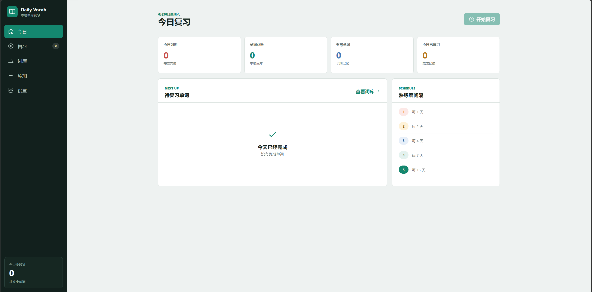
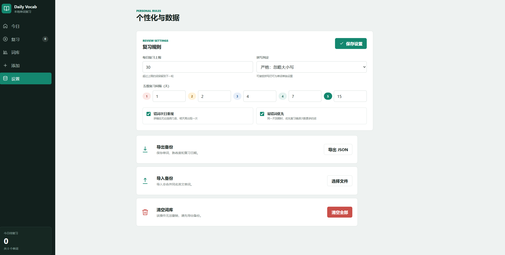
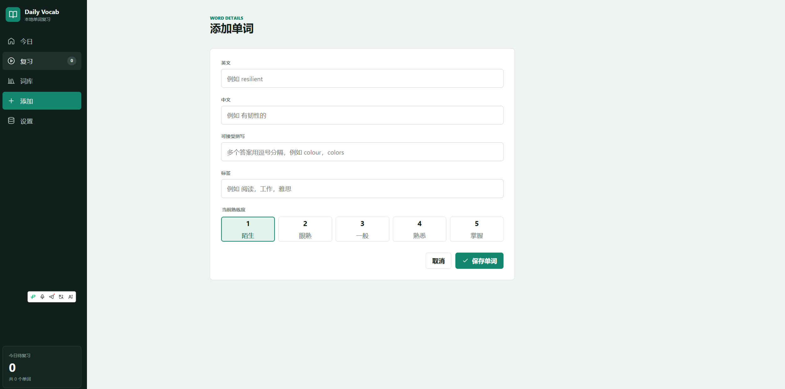

# SpellBack

> 看中文，拼英文。把真正属于你的生词记下来。


SpellBack 是一个简单的本地背单词网页。你可以录入自己遇到的英文和中文，复习时根据中文拼写英文，再用 1–5 级熟练度安排下一次复习。

它不需要安装，不需要注册账号，也不需要联网。

## 选择一种使用方式

### 方式一：只使用一个 HTML 文件（推荐）

适合普通用户，以及通过微信、QQ、邮件或 U 盘分享给别人。

你只需要这一个文件：

**`SpellBack.html`**

使用步骤：

1. [下载 `SpellBack.html`](./SpellBack.html?raw=1)，或者接收别人发来的同名文件。
2. 把文件放在一个固定文件夹中，例如“文档”或桌面上的 `SpellBack` 文件夹。
3. 双击 `SpellBack.html`。
4. 选择 Chrome、Edge 或 Firefox 打开。

页面样式、图标和程序都已经装在这个 HTML 文件里。断网时也可以正常使用，不需要旁边的其他文件。

### 方式二：下载完整项目

适合希望保留全部文件、查看源码或自行修改的人。

使用步骤：

1. 在 GitHub 仓库页面点击绿色的 **Code** 按钮。
2. 点击 **Download ZIP**。
3. 解压下载的 ZIP，不能直接在压缩包里运行。
4. Windows 用户双击 `open_vocab_web.bat`。
5. macOS 或 Linux 用户双击 `SpellBack.html`，或用浏览器打开它。

`open_vocab_web.bat` 只是 Windows 的快捷启动文件，它最终打开的仍然是 `SpellBack.html`。

完整项目中的 `index.html` 是源码入口，必须和 `styles.css`、`app.js` 放在一起。普通用户不需要打开它。

> 建议选定一种方式后一直使用同一个 HTML 文件。不同文件路径可能拥有不同的浏览器存储，单词数据不一定会自动互通。

## 第一次使用

### 1. 添加单词

打开左侧的“添加”，填写：

- 英文
- 中文
- 当前熟练度
- 可接受拼写（可选）
- 标签（可选）

新单词会在当天进入复习。

### 2. 开始复习

进入“今日”或“复习”页面。SpellBack 会显示中文，你需要手动拼写英文。

提交后会显示正确答案，然后选择新的熟练度：

| 熟练度 | 含义 | 默认多久后再复习 |
| --- | --- | ---: |
| 1 | 陌生 | 1 天 |
| 2 | 眼熟 | 2 天 |
| 3 | 一般 | 4 天 |
| 4 | 熟悉 | 7 天 |
| 5 | 掌握 | 15 天 |

这些间隔可以在“设置”中修改。

### 3. 每天打开一次

“今日”页面会自动列出到期单词。完成复习并更新熟练度后，SpellBack 会安排新的复习日期。

## SpellBack 能做什么

- **中文到英文主动拼写**：不是看一眼觉得认识，而是真的把单词拼出来。
- **自定义复习间隔**：五个熟练度的天数都可以修改。
- **每日复习上限**：控制每天需要完成的数量。
- **错词次日重现**：拼错后可以安排第二天再次复习。
- **易错词优先**：优先安排累计错误更多的单词。
- **多个正确答案**：可接受英美拼写、复数或其他有效写法。
- **标签分类**：用“阅读”“工作”“雅思”等标签整理词库。
- **正确率记录**：查看每个单词的拼写正确率。
- **完全本地运行**：没有账号、广告或后台上传。

## 保存与备份

单词和复习记录保存在当前浏览器中，不会上传到服务器。

为了避免数据丢失，请注意：

1. 第一次使用后，尽量不要移动或重命名 `SpellBack.html`。
2. 不要随意清理浏览器的网站数据。
3. 定期进入“设置”，点击“导出 JSON”保存备份。
4. 更换电脑、浏览器或文件位置时，先导出备份，再在新页面中导入。

JSON 备份包含单词、熟练度、标签、正确率、复习日期和个性化设置。

## 常见问题

### 需要安装软件吗？

不需要。下载 `SpellBack.html` 后直接双击即可。

### 需要一直联网吗？

不需要。首次下载完成后可以完全离线使用。

### 为什么打开后没有单词？

SpellBack 不带预制词书。请先进入“添加”，录入你真正需要记忆的单词。

### 换电脑后单词会自动出现吗？

不会。请在旧电脑上导出 JSON，然后在新电脑上导入。

### 为什么完整项目里还有 `index.html`？

`SpellBack.html` 是给用户直接使用的单文件版；`index.html + styles.css + app.js` 是方便开发和修改的源码版。两者功能相同。

## 界面预览







## 开发与构建

下面的内容只面向希望修改源码的开发者。普通用户可以忽略。

项目没有第三方依赖。修改 `index.html`、`styles.css` 或 `app.js` 后，运行：

```bash
node build_single_html.js
```

脚本会重新生成可分发的 `SpellBack.html`。

运行核心测试：

```bash
node --check app.js
node test_core.js
```

项目结构：

```text
vocab_web_app/
├── SpellBack.html        # 普通用户直接打开的单文件版
├── index.html            # 源码页面结构
├── styles.css            # 页面样式
├── app.js                # 词库、调度和复习逻辑
├── build_single_html.js  # 单文件构建脚本
├── test_core.js          # 核心逻辑测试
├── open_vocab_web.bat    # Windows 快捷启动入口
├── docs/screenshots/     # README 截图
├── LICENSE
└── README.md
```

## License

[MIT License](LICENSE)
